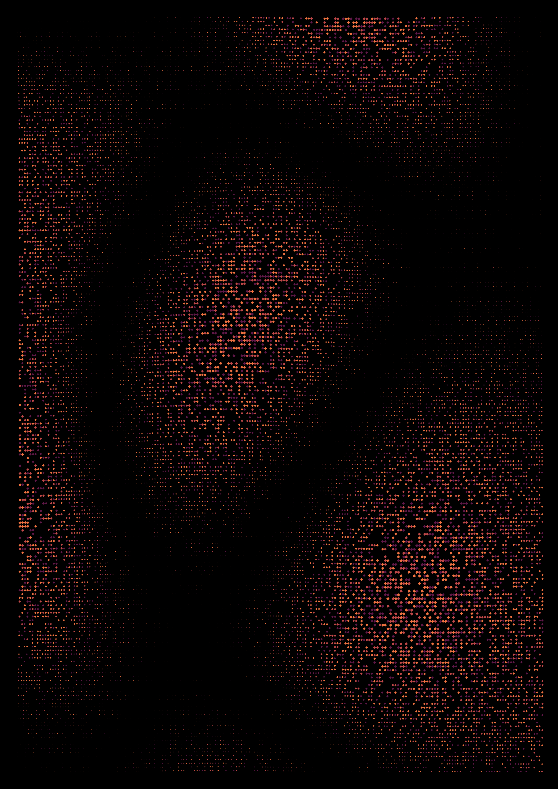

# generative example

Canvas example of generating some artistic looking art using some random noise functions and an array of characters.

### Run it

`canvas-sketch noise-on-canvas.js`

## Noise2D Example

